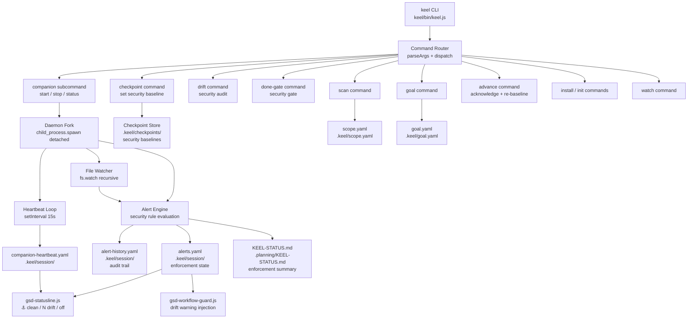
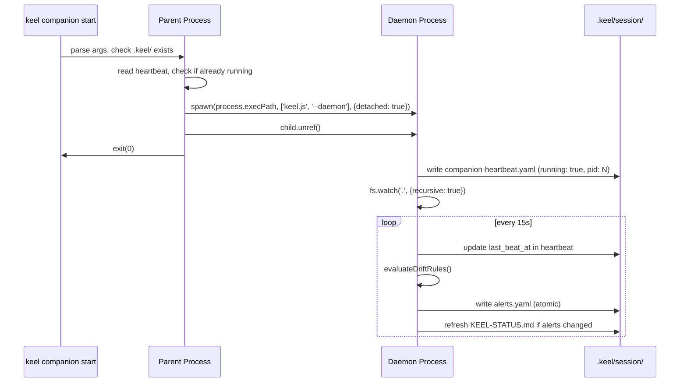

# Design Document: keel-companion

## Overview

Keel is the security layer of GSD. It is the enforcement wall that every GSD stage must pass through before completion — a real-time drift detection and blocking system that protects plan integrity at the process level. Where GSD orchestrates work, keel enforces that the work stays within scope.

The keel companion is a Node.js CLI binary (`keel`) that implements this security layer as a background daemon process. It continuously monitors the file system for scope drift — files touched outside the active plan step, goal statement drift, scope expansion — and surfaces structured enforcement alerts that GSD hooks consume to block stage completion, display security status, and inject drift warnings into agent context. Keel's role is analogous to a security checkpoint: every GSD stage passes through keel's enforcement layer, and keel decides whether the stage is clean enough to proceed.

The binary is a single entry point at `keel/bin/keel.js`, consistent with the existing Node.js toolchain (`get-shit-done/bin/gsd-tools.cjs`, `hooks/*.js`). It uses only Node.js built-ins (no npm dependencies) to keep installation friction minimal. The `keel install` command symlinks the binary onto PATH.

Key design decisions shaped by retro findings:
- Alert consolidation (cluster_id + 10s window) prevents alert storms from single pivots
- Auto-clear on condition resolution prevents stale ghost alerts (VAL-004 pattern)
- Atomic file writes (write-to-temp + rename) prevent partial reads by statusline hooks
- Graceful fallback: all GSD workflows check `command -v keel` before invoking — GSD continues to function without its security layer, but without drift protection


## Architecture

Keel's architecture is structured as a security enforcement pipeline: file system events flow through the drift detection engine, which evaluates them against the active checkpoint (the security baseline), and produces enforcement alerts that GSD hooks consume to gate stage completion.




## Process Lifecycle

### Daemon Model

The security layer runs as a background daemon — always watching, never blocking the developer's workflow. `keel companion start` forks a detached child process using `child_process.spawn` with `detached: true` and `stdio: 'ignore'`, then calls `child.unref()` so the parent exits immediately. The child writes its PID to the heartbeat file and enters the watch loop. This daemon is the heartbeat of keel's security enforcement: while it runs, every file change is evaluated against the active security baseline (checkpoint).



### PID File and Idempotency

The heartbeat file doubles as the PID file. Before starting, `keel companion start` reads `companion-heartbeat.yaml`, extracts `pid`, and checks if that process is alive via `process.kill(pid, 0)`. If alive, it exits 0 (idempotent). If the PID is stale (process gone), it overwrites the heartbeat and starts fresh.

### Stop Sequence

`keel companion stop` reads the PID from heartbeat, sends `SIGTERM`, waits up to 2 seconds for the process to exit, then writes `running: false` to the heartbeat. If no PID or process already gone, exits 0 silently.


## File System Contracts

Keel's security state is persisted entirely through well-defined file contracts. These files are the interface between keel's enforcement engine and GSD's workflow hooks — they are the mechanism by which keel's security decisions propagate into GSD's execution context.

### `.keel/session/companion-heartbeat.yaml`

The heartbeat is the liveness signal for the security layer. Written atomically (temp file + `fs.renameSync`) every 15 seconds while running. A stale heartbeat means the security layer is down — GSD displays `⚓ stale` and `keel done` blocks stage completion.

```yaml
running: true
pid: 12345
last_beat_at: "2025-01-15T10:30:00.000Z"
started_at: "2025-01-15T10:00:00.000Z"
version: "1.0.0"
```

On stop: `running: false`, `last_beat_at` preserved as final beat timestamp.

Staleness threshold: `Date.now() - new Date(last_beat_at) > 30_000ms` → companion is dead.

### `.keel/session/alerts.yaml`

The alerts file is the primary enforcement state — it is the list of active security findings that GSD hooks read to determine whether a stage can proceed. Written atomically after every drift rule evaluation. Empty sequence when no alerts (security layer is clean).

```yaml
- rule: SCOPE-001
  message: "File hooks/new-feature.js is outside active plan scope"
  severity: high
  deterministic: true
  created_at: "2025-01-15T10:31:00.000Z"
  source_file: "hooks/new-feature.js"
  cluster_id: "pivot-1736934660000"
  consolidated: false

- rule: SCOPE-001
  message: "3 related drift findings — session pivot detected"
  severity: high
  deterministic: true
  created_at: "2025-01-15T10:31:05.000Z"
  source_file: null
  cluster_id: "pivot-1736934660000"
  consolidated: true
  child_count: 3
  child_rules:
    - SCOPE-001
    - SCOPE-002
    - GOAL-001
```

Field definitions:
- `rule`: rule identifier (SCOPE-001, GOAL-001, VAL-004, STEP-001)
- `message`: human-readable description
- `severity`: `high` | `medium` | `low`
- `deterministic`: `true` if the alert is a hard blocker for `keel done`
- `created_at`: ISO 8601 UTC
- `source_file`: relative path from repo root, or `null`
- `cluster_id`: string key grouping related alerts (format: `<event>-<epoch_ms>`)
- `consolidated`: `true` for parent alerts that replace child alerts
- `child_count`: number of consolidated children (consolidated alerts only)
- `child_rules`: array of rule IDs from children (consolidated alerts only)

### `.keel/session/alert-history.yaml`

The audit trail. Append-only log of cleared alerts — every enforcement finding that was resolved is recorded here with a timestamp and reason. Never truncated by the companion. This provides a complete security audit history for the session.

```yaml
- rule: VAL-004
  message: "Unresolved questions detected"
  cluster_id: "val-1736934000000"
  cleared_at: "2025-01-15T10:35:00.000Z"
  cleared_reason: auto
```

`cleared_reason` values: `auto` (condition resolved), `advance` (user ran `keel advance`), `checkpoint` (new checkpoint taken).

### `.keel/checkpoints/<timestamp>.yaml`

Checkpoints are the security baselines. Written by `keel checkpoint`, each checkpoint defines the enforcement boundary — the set of files, directories, goals, and plan steps that constitute "in scope." All drift detection is measured against the active checkpoint. Filename format: `YYYY-MM-DDTHH-MM-SS.yaml`.

```yaml
created_at: "2025-01-15T10:00:00.000Z"
goal: "Implement keel companion binary"
phase: "3.1"
in_scope_files:
  - "keel/bin/keel.js"
  - "keel/bin/lib/daemon.js"
  - "keel/bin/lib/alerts.js"
  - ".keel/**"
in_scope_dirs:
  - "keel/"
plan_steps:
  - id: "3.1.1"
    description: "Create entry point"
    completed: false
  - id: "3.1.2"
    description: "Implement daemon fork"
    completed: false
```

### `.keel/scope.yaml`

Written by `keel scan`. Describes the active scope manifest.

```yaml
scanned_at: "2025-01-15T10:00:00.000Z"
root: "."
in_scope:
  - pattern: "keel/**"
    reason: active_plan
  - pattern: ".keel/**"
    reason: keel_state
  - pattern: "hooks/*.js"
    reason: related_component
out_of_scope:
  - pattern: "docs/**"
  - pattern: "assets/**"
```

### `.keel/goal.yaml`

Written by `keel goal`. Single source of truth for the tracked goal.

```yaml
goal: "Implement keel companion binary with drift detection"
source: "ROADMAP.md"
phase: "3.1"
captured_at: "2025-01-15T10:00:00.000Z"
```

### `.keel/keel.yaml`

Config file written by `keel init`.

```yaml
version: "1.0.0"
initialized_at: "2025-01-15T09:00:00.000Z"
watch:
  debounce_ms: 500
  ignore_patterns:
    - ".git/**"
    - "node_modules/**"
    - ".keel/**"
alerts:
  consolidation_window_ms: 10000
  stale_heartbeat_threshold_ms: 30000
done_gate:
  require_fresh_heartbeat: true
  block_on_high_severity: true
```

### `.planning/KEEL-STATUS.md`

The human/agent-readable enforcement summary. Written after any state-changing command. This is how keel's security state is surfaced into GSD agent context — agents read this file to understand the current enforcement posture without spawning subprocesses. Skipped silently if `.planning/` doesn't exist.

```markdown
# KEEL Status

Last updated: 2025-01-15T10:31:00.000Z

## Goal

Implement keel companion binary with drift detection

## Phase

3.1 — keel-companion

## Next Step

3.1.2 — Implement daemon fork

## Active Alerts

- [high] SCOPE-001: File hooks/new-feature.js is outside active plan scope

## Blockers

- Resolve SCOPE-001 drift before running keel done
```

When no alerts: `## Active Alerts\n\nNo active alerts.`


## Alert Engine

The Alert Engine is the core of keel's security layer — it evaluates drift rules against the current repo state and produces enforcement alerts that determine whether GSD stages can proceed.

### Drift Rule Definitions

Each rule represents a specific security invariant that keel enforces. Rules with `deterministic: true` are hard blockers — they prevent stage completion via the done-gate.

| Rule ID | Trigger | Severity | Deterministic |
|---------|---------|----------|---------------|
| SCOPE-001 | File written outside `in_scope_files` + `in_scope_dirs` from active checkpoint | high | true |
| GOAL-001 | `goal.yaml` goal text differs from active checkpoint goal by >20% (Levenshtein) | high | true |
| STEP-001 | Plan step marked complete in checkpoint but corresponding file not modified | medium | false |
| VAL-004 | `unresolved-questions.yaml` exists and is non-empty | high | true |

Rules are evaluated in order: SCOPE-001 → GOAL-001 → VAL-004 → STEP-001.

### Consolidation Algorithm

```
ALGORITHM consolidateAlerts(newAlerts, existingAlerts, windowMs)
INPUT: newAlerts — alerts generated in this evaluation cycle
       existingAlerts — alerts currently in alerts.yaml
       windowMs — consolidation window (default 10000ms)
OUTPUT: finalAlerts — deduplicated, consolidated alert list

BEGIN
  now ← Date.now()
  
  // Group new alerts by cluster_id
  clusters ← GROUP newAlerts BY cluster_id
  
  FOR each (clusterId, clusterAlerts) IN clusters DO
    IF clusterAlerts.length >= 2 THEN
      // Check if all were generated within the window
      oldest ← MIN(clusterAlerts.map(a => new Date(a.created_at)))
      IF (now - oldest) <= windowMs THEN
        parent ← {
          rule: clusterAlerts[0].rule,
          message: clusterAlerts.length + " related drift findings — session pivot detected",
          severity: MAX(clusterAlerts.map(a => a.severity)),
          deterministic: ANY(clusterAlerts.map(a => a.deterministic)),
          created_at: ISO8601(now),
          source_file: null,
          cluster_id: clusterId,
          consolidated: true,
          child_count: clusterAlerts.length,
          child_rules: clusterAlerts.map(a => a.rule)
        }
        REPLACE clusterAlerts WITH [parent] IN newAlerts
      END IF
    END IF
  END FOR
  
  // Merge with existing: keep existing alerts whose conditions still hold
  // (auto-clear handled separately in evaluateDriftRules)
  RETURN newAlerts
END
```

### Auto-Clear Mechanism

Keel's security layer is designed to be precise — it blocks when drift exists and unblocks the moment drift resolves. On each watch cycle, the engine re-evaluates all active rules. For each alert currently in `alerts.yaml`:

1. Re-evaluate the alert's rule condition against current repo state
2. If condition is no longer true → remove from `alerts.yaml`, append to `alert-history.yaml` with `cleared_reason: auto`
3. If condition still true → keep alert (preserve original `created_at`)

This ensures VAL-004 clears within one watch cycle after `unresolved-questions.yaml` is emptied.

### Watch Cycle

```
ALGORITHM watchCycle(event, filePath)
INPUT: event — 'change' | 'rename'
       filePath — path that changed (relative to repo root)

BEGIN
  // Debounce: skip if same path changed within 500ms
  IF isDebounced(filePath) THEN RETURN END IF
  markDebounced(filePath, 500ms)
  
  // Skip keel's own state files to prevent feedback loops
  IF filePath STARTS WITH ".keel/" THEN RETURN END IF
  
  // Evaluate all drift rules
  newAlerts ← evaluateDriftRules(filePath)
  
  // Auto-clear stale alerts
  currentAlerts ← readAlertsYaml()
  clearedAlerts ← []
  FOR each alert IN currentAlerts DO
    IF NOT ruleConditionHolds(alert.rule, alert.source_file) THEN
      clearedAlerts.push(alert)
    END IF
  END FOR
  
  // Write cleared alerts to history
  FOR each alert IN clearedAlerts DO
    appendAlertHistory(alert, cleared_reason: "auto")
  END FOR
  
  // Consolidate new alerts
  activeAlerts ← currentAlerts MINUS clearedAlerts PLUS newAlerts
  finalAlerts ← consolidateAlerts(activeAlerts)
  
  // Atomic write
  writeAtomic(".keel/session/alerts.yaml", toYaml(finalAlerts))
  
  // Refresh KEEL-STATUS.md if alert state changed
  IF finalAlerts != currentAlerts THEN
    writeKeelStatus()
  END IF
END
```


## Drift Detection

Drift detection is the sensing mechanism of keel's security layer — it identifies when the repo state has deviated from the active security baseline (checkpoint).

### File Watcher Implementation

Uses `fs.watch(cwd, { recursive: true })` (Node.js built-in, no chokidar dependency). On platforms where recursive watch is unsupported (Linux kernel < 5.x), falls back to watching top-level directories individually.

Ignore patterns from `keel.yaml` are applied before rule evaluation:
- `.git/**`
- `node_modules/**`
- `.keel/**` (prevents feedback loops on state file writes)

### Checkpoint Diffing

`keel drift` compares current state against the most recent checkpoint:

```
ALGORITHM computeDrift(checkpoint)
INPUT: checkpoint — loaded from .keel/checkpoints/<latest>.yaml
OUTPUT: driftReport — { drifted: bool, alerts: [], blockers: [] }

BEGIN
  driftedFiles ← []
  
  // Find files modified since checkpoint was taken
  modifiedFiles ← getFilesModifiedSince(checkpoint.created_at)
  
  FOR each file IN modifiedFiles DO
    IF NOT isInScope(file, checkpoint.in_scope_files, checkpoint.in_scope_dirs) THEN
      driftedFiles.push(file)
    END IF
  END FOR
  
  // Check goal drift
  currentGoal ← readGoalYaml().goal
  goalDrifted ← levenshteinDistance(currentGoal, checkpoint.goal) / MAX(len) > 0.20
  
  // Check VAL-004
  hasUnresolvedQuestions ← fileExistsAndNonEmpty("unresolved-questions.yaml")
  
  RETURN {
    drifted: driftedFiles.length > 0 OR goalDrifted OR hasUnresolvedQuestions,
    alerts: buildAlerts(driftedFiles, goalDrifted, hasUnresolvedQuestions),
    blockers: alerts.filter(a => a.deterministic)
  }
END
```

### Scope Manifest (`keel scan`)

`keel scan` walks the repo and infers scope from:
1. Files referenced in the active checkpoint's `in_scope_files`
2. Directories containing those files
3. Files modified in the last git commit (if git is available)
4. Files matching patterns in `.planning/` state (phase task files)

Writes result to `.keel/scope.yaml`.


## Done-Gate

The done-gate is keel's hard enforcement boundary — the security checkpoint that every GSD stage must pass through before completion. It is the mechanism by which keel's security layer prevents scope integrity violations at GSD workflow boundaries.

### Check Evaluation Order

`keel done` runs 4 security checks in sequence, stopping at the first failure:

```
ALGORITHM doneGate()
OUTPUT: { passed: bool, reason: string, blockers: [] }

BEGIN
  blockers ← []
  
  // Check 1: Companion heartbeat freshness
  heartbeat ← readHeartbeatYaml()
  IF heartbeat IS NULL OR NOT heartbeat.running THEN
    blockers.push({ check: "heartbeat", message: "Companion is not running — start with: keel companion start" })
  ELSE IF (now - new Date(heartbeat.last_beat_at)) > 30000 THEN
    blockers.push({ check: "heartbeat", message: "Companion heartbeat is stale — restart with: keel companion stop && keel companion start" })
  END IF
  
  // Check 2: No high-severity deterministic alerts
  alerts ← readAlertsYaml()
  highAlerts ← alerts.filter(a => a.severity == "high" AND a.deterministic)
  IF highAlerts.length > 0 THEN
    FOR each alert IN highAlerts DO
      blockers.push({ check: "alerts", message: alert.message, rule: alert.rule })
    END FOR
  END IF
  
  // Check 3: Goal has not drifted from checkpoint
  checkpoint ← loadLatestCheckpoint()
  IF checkpoint IS NOT NULL THEN
    currentGoal ← readGoalYaml().goal
    IF levenshteinRatio(currentGoal, checkpoint.goal) > 0.20 THEN
      blockers.push({ check: "goal", message: "Goal has drifted from checkpoint — run: keel goal to re-anchor" })
    END IF
  END IF
  
  // Check 4: All plan steps completed or have recorded delta
  IF checkpoint IS NOT NULL THEN
    incompleteSteps ← checkpoint.plan_steps.filter(s => NOT s.completed AND NOT s.delta)
    IF incompleteSteps.length > 0 THEN
      blockers.push({ check: "steps", message: incompleteSteps.length + " plan steps incomplete — run: keel advance" })
    END IF
  END IF
  
  IF blockers.length == 0 THEN
    RETURN { passed: true, reason: "✓ done-gate passed", blockers: [] }
  ELSE
    RETURN { passed: false, reason: blockers[0].message, blockers: blockers }
  END IF
END
```

### Exit Codes

- `0`: all checks passed
- `1`: one or more checks failed (blockers printed to stdout)
- `2`: internal error (e.g., cannot read state files)


## Command Implementations

### Binary Entry Point

`keel/bin/keel.js` — single file, shebang `#!/usr/bin/env node`, no external dependencies. This is the entry point to keel's security layer — every enforcement action flows through this binary.

```
keel/
  bin/
    keel.js              ← entry point + command router (security layer CLI)
    lib/
      daemon.js          ← fork/stop/status logic (security daemon lifecycle)
      alerts.js          ← Alert Engine (security rule evaluation, consolidation, auto-clear)
      checkpoint.js      ← checkpoint read/write/diff (security baseline management)
      scan.js            ← scope manifest generation (security perimeter definition)
      status.js          ← KEEL-STATUS.md writer (enforcement summary)
      atomic.js          ← atomic file write helper (write-temp + rename)
      yaml.js            ← minimal YAML serializer/parser (no deps)
```

### Command Table

| Command | Behavior | Exit codes |
|---------|----------|------------|
| `keel companion start` | Fork security daemon if not running; idempotent if already running | 0 success, 1 no .keel/ |
| `keel companion stop` | SIGTERM security daemon, update heartbeat running:false; idempotent if not running | 0 always |
| `keel companion status` | Print security layer state `running: true\|false` + `last_beat_at`; stale if >30s | 0 always |
| `keel checkpoint` | Snapshot current state as new security baseline to `.keel/checkpoints/<ts>.yaml`; clear cluster alerts | 0 success, 1 error |
| `keel drift` | Security audit: compare current state vs latest checkpoint; print drift report | 0 clean, 1 drift found |
| `keel drift --json` | Same but output `{drifted, alerts, blockers}` JSON | 0 clean, 1 drift found |
| `keel drift --verbose` | Expand consolidated alerts to show children | 0 clean, 1 drift found |
| `keel done` | Run 4-check security gate; print result | 0 passed, 1 blocked, 2 error |
| `keel done --json` | Same but output `{passed, reason, blockers}` JSON | 0 passed, 1 blocked |
| `keel goal` | Read goal from ROADMAP.md / .planning/ state; write goal.yaml | 0 success, 1 error |
| `keel scan` | Walk repo, infer scope, write scope.yaml | 0 success, 1 error |
| `keel advance` | Mark current step complete, write new security baseline, clear step alerts | 0 success, 1 error |
| `keel watch` | Start security watcher in foreground (non-daemon); print events to stdout | 0 on SIGINT |
| `keel install` | Bootstrap security layer: create .keel/ structure, init, scan, start companion; idempotent | 0 success, 1 error |
| `keel init` | Create .keel/session/, .keel/checkpoints/, write keel.yaml | 0 success, 1 error |

### `keel install` Sequence

Bootstraps the complete security layer for a GSD project:

```
1. Check if .keel/ already exists → if yes, print advisory and exit 0
2. Create .keel/, .keel/session/, .keel/checkpoints/
3. Write .keel/keel.yaml with defaults
4. Run keel scan (define security perimeter)
5. Run keel goal (capture goal from ROADMAP.md if present)
6. Run keel checkpoint (establish initial security baseline)
7. Run keel companion start (activate real-time enforcement)
8. Add .keel/session/ to .gitignore
9. Install git hooks (post-checkout, post-commit)
10. Print confirmation: "✓ keel installed — security layer active\n  Next: keel drift"
```

### `keel advance` Sequence

Acknowledges progress and re-establishes the security baseline:

```
1. Load latest checkpoint (current security baseline)
2. Find first incomplete plan step
3. Mark it completed: true
4. Write updated checkpoint (new security baseline with new timestamp)
5. Clear all alerts with cluster_id matching that step
6. Append cleared alerts to alert-history.yaml with cleared_reason: "advance"
7. Refresh KEEL-STATUS.md (update enforcement summary)
8. Print: "✓ Step <id> marked complete"
```

### PATH Installation (`keel install --link`)

Creates a symlink at `/usr/local/bin/keel` → `<repo>/keel/bin/keel.js`. Falls back to `~/bin/keel` if `/usr/local/bin` is not writable. Prints the resolved path on success.


## Components and Interfaces

These modules implement the internal subsystems of keel's security layer. Each module has a focused responsibility within the enforcement pipeline.

### `daemon.js`

Manages the security daemon lifecycle — starting, stopping, and querying the enforcement process.

```javascript
// Start the companion daemon. Returns immediately after fork.
// Throws if .keel/ does not exist.
function startDaemon(cwd)

// Stop the companion daemon via SIGTERM.
// Resolves when process exits or was already stopped.
async function stopDaemon(cwd)

// Read heartbeat and return status object.
// Returns { running: false } if heartbeat file absent.
function getStatus(cwd)
// → { running: bool, pid: number|null, last_beat_at: string|null, stale: bool }

// Internal: daemon entry point (called when process.argv includes '--daemon')
function runDaemonLoop(cwd)
```

### `alerts.js`

The enforcement engine — evaluates security rules, consolidates alert storms, and auto-clears resolved findings.

```javascript
// Evaluate all drift rules against current repo state.
// Returns array of new alert objects (not yet written to disk).
function evaluateDriftRules(cwd, changedFile)
// → Alert[]

// Consolidate alerts within the time window.
// Mutates nothing; returns new array.
function consolidateAlerts(alerts, windowMs)
// → Alert[]

// Determine if a rule's source condition currently holds.
function ruleConditionHolds(rule, sourceFile, cwd)
// → boolean

// Read alerts.yaml; returns [] if file absent or empty.
function readAlerts(cwd)
// → Alert[]

// Write alerts atomically.
function writeAlerts(cwd, alerts)

// Append entries to alert-history.yaml.
function appendAlertHistory(cwd, clearedAlerts, clearedReason)
```

### `checkpoint.js`

Manages security baselines — the snapshots against which all drift is measured.

```javascript
// Write a new checkpoint snapshot.
function writeCheckpoint(cwd, data)
// data: { goal, phase, in_scope_files, in_scope_dirs, plan_steps }

// Load the most recent checkpoint. Returns null if none exist.
function loadLatestCheckpoint(cwd)
// → Checkpoint | null

// Compute drift between current state and a checkpoint.
function computeDrift(cwd, checkpoint)
// → { drifted: bool, alerts: Alert[], blockers: Alert[] }
```

### `atomic.js`

Ensures state file integrity — prevents partial reads that could cause GSD hooks to misread the security layer's enforcement state.

```javascript
// Write content to path atomically via temp file + rename.
// Prevents partial reads by concurrent hook processes.
function writeAtomic(filePath, content)
```

### `yaml.js`

Minimal YAML serializer/parser covering only the subset used by keel's security state files (strings, numbers, booleans, arrays of objects, nested objects). No external dependency. Data integrity of the security layer's state files depends on this module's round-trip correctness.

```javascript
function parseYaml(text)   // → JS value
function stringifyYaml(value)  // → string
```


## Error Handling

Keel's error handling is designed around a core principle: the security layer should never break the developer's workflow. When keel can't enforce, it degrades gracefully — GSD continues without drift protection rather than blocking on keel infrastructure failures.

### Scenario: `.keel/` does not exist

**Condition**: Any keel command invoked before `keel install` — security layer not bootstrapped
**Response**: Print `keel not initialized — run: keel install` to stderr, exit 1
**Recovery**: User runs `keel install`

### Scenario: Companion crashes mid-session

**Condition**: Security daemon dies; heartbeat becomes stale (>30s) — enforcement layer is down
**Response**: `gsd-statusline.js` displays `⚓ stale` in dim; `keel done` blocks stage completion with a stale-companion blocker; no automatic restart
**Recovery**: User runs `keel companion stop && keel companion start`

### Scenario: Heartbeat file partially written

**Condition**: Race between security daemon write and hook read
**Response**: Atomic write (temp + rename) prevents partial reads; hook reads complete file or previous version — security state is never ambiguous
**Recovery**: Automatic — next heartbeat write succeeds

### Scenario: `keel` binary not on PATH

**Condition**: Security layer binary absent or removed after install — enforcement unavailable
**Response**: `init.cjs` `detectKeel()` returns `{ keel_installed: false }`; all GSD workflows skip keel enforcement blocks; `gsd-statusline.js` continues displaying last known heartbeat state without invoking binary — GSD operates without its security layer
**Recovery**: User re-runs `keel install --link`

### Scenario: Permission error creating `.keel/`

**Condition**: `keel install` in read-only directory
**Response**: Print descriptive error to stderr with the failing path, exit 1
**Recovery**: User fixes permissions or runs from correct directory

### Scenario: `fs.watch` not supported recursively

**Condition**: Linux kernel without inotify recursive support — security monitoring degraded
**Response**: Fall back to watching each top-level directory individually; log warning to stderr
**Recovery**: Automatic fallback; slightly higher overhead but security enforcement remains active


## Correctness Properties

*A property is a characteristic or behavior that should hold true across all valid executions of a system — essentially, a formal statement about what the system should do. Properties serve as the bridge between human-readable specifications and machine-verifiable correctness guarantees.*

These properties formalize the security invariants that keel's enforcement layer must maintain. They are suitable for property-based testing (PBT) using fast-check.

### P1: Alert Consolidation Invariant

*For any* set of alerts generated by a single root cause event (same `cluster_id`) within the consolidation window, the number of entries written to `alerts.yaml` must be ≤ the number of distinct root causes — the security layer must never overwhelm the agent with redundant enforcement findings.

```
∀ alerts ∈ alerts.yaml,
  ∀ clusterId ∈ distinct(alerts.map(a => a.cluster_id)):
    count(alerts where cluster_id == clusterId AND NOT consolidated) == 0
    OR count(alerts where cluster_id == clusterId) == 1
```

**PBT approach**: Generate N alerts with the same `cluster_id` within a 10s window. After consolidation, assert `result.length == 1` and `result[0].consolidated == true` and `result[0].child_count == N`.

### P2: Staleness Invariant

*For any* alert in `alerts.yaml`, its source condition must currently hold — the security layer must never block on ghost findings whose source condition has resolved.

```
∀ alert ∈ alerts.yaml:
  ruleConditionHolds(alert.rule, alert.source_file, cwd) == true
```

**PBT approach**: Generate arbitrary alert sets, then for each alert randomly toggle its source condition to false. After one watch cycle, assert no alert with a false condition remains in `alerts.yaml`.

### P3: Atomic Write Integrity

*For any* concurrent read of the heartbeat or alerts file, the reader must observe either a complete valid state or the previous valid state — the security layer's enforcement state must never be ambiguous to GSD hooks.

```
∀ read(heartbeat.yaml): parse(content) succeeds OR content == previous_valid_content
∀ read(alerts.yaml): parse(content) succeeds OR content == previous_valid_content
```

**PBT approach**: Simulate concurrent reads during writes using `fs.readFileSync` in a tight loop while `writeAtomic` is executing. Assert every read either parses successfully or returns the previous valid content.

### P4: Idempotent Start

*For any* number of `keel companion start` invocations, exactly one security daemon process must be running — the enforcement layer must never fork duplicate processes.

```
∀ n ≥ 1: after n calls to startDaemon(cwd),
  count(processes matching security daemon signature) == 1
```

**PBT approach**: Call `startDaemon` 1–5 times in sequence. Assert exactly one process with the keel daemon signature is running after all calls.

### P5: Done-Gate Soundness

*For any* combination of the 4 security check states, `keel done` exits 0 if and only if all 4 checks pass simultaneously — the security gate must be sound (never lets drift through) and complete (never blocks clean stages).

```
doneGate().passed == true
  ↔ heartbeatFresh() ∧ noHighAlerts() ∧ goalNotDrifted() ∧ allStepsComplete()
```

**PBT approach**: Generate arbitrary combinations of the 4 check states (fresh/stale, alerts/no-alerts, drifted/clean, complete/incomplete). Assert `passed` matches the conjunction of all 4 conditions.

### P6: Alert History Completeness

*For any* alert removed from `alerts.yaml`, a corresponding entry must appear in `alert-history.yaml` with a valid `cleared_at` timestamp and `cleared_reason` — the security audit trail must be complete.

```
∀ alert removed from alerts.yaml:
  ∃ entry ∈ alert-history.yaml where
    entry.rule == alert.rule AND
    entry.cluster_id == alert.cluster_id AND
    entry.cleared_at IS valid ISO 8601 AND
    entry.cleared_reason ∈ { "auto", "advance", "checkpoint" }
```

**PBT approach**: Generate arbitrary alert sets, trigger clearing via auto/advance/checkpoint paths, assert every removed alert has a corresponding history entry.

### P7: Heartbeat Monotonicity

*For any* consecutive heartbeat writes, `last_beat_at` must be non-decreasing — the security layer's liveness signal must never go backwards in time.

```
∀ consecutive heartbeat writes t1, t2:
  new Date(t2.last_beat_at) >= new Date(t1.last_beat_at)
```

**PBT approach**: Run the heartbeat loop for N iterations with arbitrary clock values. Assert each successive `last_beat_at` is ≥ the previous.


## Testing Strategy

### Unit Testing

**Framework**: Node.js built-in `node:test` + `assert` (no external test runner, consistent with the zero-dependency philosophy).

**Key unit test areas**:

- `yaml.js`: round-trip parse/stringify for all YAML shapes used in security state files
- `atomic.js`: verify temp file is cleaned up on success and failure — state file integrity is critical for the security layer
- `alerts.js` `consolidateAlerts()`: all consolidation edge cases (1 alert, 2 alerts same cluster, 2 alerts different clusters, window boundary)
- `alerts.js` `ruleConditionHolds()`: each security rule with true/false conditions
- `checkpoint.js` `computeDrift()`: clean state, single drifted file, goal drift, VAL-004
- `daemon.js` `getStatus()`: absent file, running=true fresh, running=true stale, running=false

### Property-Based Testing

**Library**: `fast-check` (add as dev dependency only).

Implement the 7 correctness properties defined above as fast-check property tests. These properties formalize the security invariants that keel must maintain:

```javascript
// P1: Consolidation invariant
fc.assert(fc.property(
  fc.array(alertArbitrary(), { minLength: 2, maxLength: 10 }),
  (alerts) => {
    const sameCluster = alerts.map(a => ({ ...a, cluster_id: 'test-cluster' }))
    const result = consolidateAlerts(sameCluster, 10_000)
    return result.length === 1 && result[0].consolidated === true
  }
))
```

### Integration Testing

**Approach**: Spin up a real security daemon against a temp directory, make file changes, assert enforcement alerts appear within 5 seconds.

**Key integration scenarios**:
1. Full security lifecycle: install → start → write out-of-scope file → assert SCOPE-001 alert → delete file → assert alert cleared
2. Alert storm: write 3 out-of-scope files within 10s → assert single consolidated enforcement alert
3. Security gate: start companion → take checkpoint → write in-scope files → run `keel done` → assert exit 0 (security gate passes)
4. Stale heartbeat: kill security daemon directly → wait 31s → assert `keel companion status` shows stale (enforcement layer down)

### Manual Smoke Tests

Run against a real GSD repo to verify the security layer end-to-end:
```bash
keel install
keel companion status   # → running: true (security layer active)
keel drift              # → clean (no drift from security baseline)
# touch a file outside scope
keel drift              # → 1 drift finding (security violation detected)
keel done               # → exit 1, security blocker listed
keel advance            # → step marked complete, security baseline updated
keel done               # → exit 0 (security gate passes)
```

## Performance Considerations

- Heartbeat write: 15s interval, ~200 bytes per write — negligible I/O
- Watch cycle debounce: 500ms prevents thrashing on rapid saves
- Alert evaluation: O(N) where N = number of in-scope files in checkpoint; expected N < 500 for typical GSD repos
- `keel drift` cold start: reads 1 checkpoint file + current file mtimes; target < 200ms
- `keel done` cold start: reads heartbeat + alerts + checkpoint; target < 100ms

## GSD Phase Lifecycle Integration

### Overview

GSD fully orchestrates keel's security layer lifecycle. The security enforcement activates automatically when GSD phases begin and deactivates when they end. Users never invoke keel directly during normal GSD operation — GSD manages the security layer transparently, ensuring every phase is protected by real-time drift detection.

### Phase Start Sequence

When a GSD phase begins (via `execute-phase` or equivalent), the security layer is activated:

```
1. GSD_Init returns JSON context including keel_installed: bool
2. IF keel_installed == true:
   a. Invoke: keel companion start  (activate security enforcement, fire-and-forget)
   b. Invoke: keel checkpoint        (establish security baseline for this phase)
3. Continue with phase work (now protected by real-time drift detection)
```

`keel companion start` is idempotent — if the security daemon is already running, it exits 0 without disruption. GSD workflows never check `keel companion status` before calling start; the idempotency guarantee makes the status check unnecessary and avoids latency.

### Phase End Sequence

When a GSD phase ends (via `verify-work` or equivalent), the security gate is evaluated:

```
1. IF keel_installed == true:
   a. Invoke: keel done              (security gate — pass/fail enforcement check)
   b. IF keel done exits non-zero:
      - Surface security blocker message to agent
      - Halt phase completion (security layer blocks the stage)
      - Print resolution command (keel advance or keel checkpoint)
   c. IF keel done exits 0:
      - Invoke: keel companion stop  (deactivate security enforcement)
2. Continue with phase completion
```

### Silent Invocation Contract

All GSD workflow keel invocations redirect stdout and stderr to `/dev/null` unless the output is explicitly consumed (e.g., `keel done` security blocker messages, `keel drift --json` output). The security layer operates silently during normal GSD operation — it only surfaces when enforcement action is needed.

```bash
# Pattern for fire-and-forget keel calls in GSD workflows
keel companion start 2>/dev/null
keel checkpoint 2>/dev/null

# Pattern for consumed output
DRIFT_JSON=$(keel drift --json 2>/dev/null)
```

### Milestone Completion Blocking

When `complete-milestone` is invoked, keel's security layer enforces a final drift check:

```
1. IF keel_installed == true AND .keel/session/alerts.yaml exists:
   a. Read alerts.yaml (current enforcement state)
   b. IF any alert has severity: high AND deterministic: true:
      - Invoke: keel done (security gate)
      - IF keel done exits non-zero: block milestone completion, surface security blockers
2. Continue with milestone completion
```

If `.keel/session/alerts.yaml` does not exist or is empty, the drift gate is treated as passed.

### Fallback When Binary Is Absent

If `command -v keel` fails at any GSD phase hook invocation point, the entire security enforcement block is skipped silently. GSD continues to function identically — just without drift protection. The `keel_installed` field from `GSD_Init` is the single gate — GSD workflows check this field once rather than re-running `command -v keel` inline.


## Drift Data Feedback into GSD Context

Keel's security findings are automatically surfaced into GSD's planning context so agents can see the enforcement posture without explicitly invoking keel commands.

### KEEL-STATUS.md Refresh Contract

The security daemon refreshes `.planning/KEEL-STATUS.md` whenever enforcement state changes during a watch cycle. This keeps the security summary current for GSD agents reading `.planning/` context.

Refresh triggers:
- Any new alert written to `alerts.yaml`
- Any alert cleared from `alerts.yaml`
- `keel companion start` (initial write, before first watch cycle)
- Any state-changing keel command (`keel checkpoint`, `keel advance`, `keel goal`, `keel scan`)

The file is skipped silently if `.planning/` does not exist.

### High-Severity Warning Section

When KEEL-STATUS.md is written and one or more `severity: high` alerts are active, the security summary includes a `## ⚠ Drift Warning` section — this is the primary mechanism by which keel's security findings are surfaced to GSD agents during execution:

```markdown
## ⚠ Drift Warning

The following blockers must be resolved before phase completion:

- SCOPE-001: File hooks/new-feature.js is outside active plan scope
  Resolution: run `keel advance` to acknowledge or revert the file

- VAL-004: Unresolved questions detected
  Resolution: resolve questions in unresolved-questions.yaml
```

### Drift Report JSON Persistence

`keel drift --json` writes its security audit output to two destinations simultaneously:
1. stdout (for direct consumption by calling scripts)
2. `.keel/session/drift-report.json` (for GSD hooks to read without re-invoking keel)

This allows GSD hooks to read the last security audit report without spawning a subprocess.

### GSD_Init Context Enrichment

When `GSD_Init` is called with `keel_installed: true`, the response includes the security layer's current state:

```json
{
  "keel_installed": true,
  "keel_status": {
    "running": true,
    "pid": 12345,
    "last_beat_at": "2025-01-15T10:30:00.000Z",
    "stale": false
  }
}
```

`keel_status` is `null` if the heartbeat file is absent. This gives GSD workflows the security layer's liveness state without a separate file read.

### Context Freshness Gate

GSD workflows include KEEL-STATUS.md in agent context only when:
- The file exists at `.planning/KEEL-STATUS.md`
- The `Last updated` timestamp is within 60 seconds of the current time

If the security summary is absent or stale, the workflow proceeds without KEEL context and surfaces no error to the agent.


## Git Event Integration

Git events are a critical input to keel's security layer — branch switches and commits change the context that drift is measured against. Keel hooks into git to keep its security baselines anchored to the actual git context.

### Git Hook Installation

`keel install` installs two git hooks into `.git/hooks/` that feed git events into the security layer:

**`.git/hooks/post-checkout`**:
```bash
#!/bin/sh
# keel git integration — post-checkout
keel git-event branch-switch "$1" "$2" "$3" 2>/dev/null || true
```

**`.git/hooks/post-commit`**:
```bash
#!/bin/sh
# keel git integration — post-commit
keel git-event commit 2>/dev/null || true
```

Both hooks exit 0 unconditionally (via `|| true`) so a security layer failure never blocks git operations. If `.git/` does not exist, `keel install` skips hook installation silently.

### Branch Switch Handling

When a `post-checkout` event fires (branch switch, not file checkout):

```
ALGORITHM handleBranchSwitch(prevHead, newHead, isBranchSwitch)
BEGIN
  IF NOT isBranchSwitch THEN RETURN END IF  // file checkout, not branch switch

  newBranch ← getCurrentBranch()
  activePhase ← loadLatestCheckpoint().phase  // e.g., "3.1"

  IF newBranch CONTAINS activePhase THEN
    // Branch matches active phase — clean context switch
    clearAlertsWithRule("GIT-001")
    writeCheckpoint(cwd, { ...currentState, branch: newBranch })
    writeKeelStatus(cwd)
  ELSE
    // Branch does not match — potential context mismatch
    writeAlert({
      rule: "GIT-001",
      message: "Branch switched to '" + newBranch + "' — verify this matches active phase " + activePhase,
      severity: "medium",
      deterministic: false,
      cluster_id: "git-" + Date.now()
    })
    writeKeelStatus(cwd)
  END IF
END
```

### Commit Auto-Checkpoint

When a `post-commit` event fires and the security daemon is running, keel automatically re-baselines:

```
ALGORITHM handleCommit()
BEGIN
  IF NOT companionIsRunning() THEN RETURN END IF
  writeCheckpoint(cwd, { ...currentState, git_commit: getHeadCommitHash() })
  writeKeelStatus(cwd)
END
```

This anchors the committed state as the new security baseline, preventing false positives for files that were intentionally committed.

### Git Rule Definition

| Rule ID | Trigger | Severity | Deterministic |
|---------|---------|----------|---------------|
| GIT-001 | Branch switch to a branch not matching the active GSD phase identifier | medium | false |

GIT-001 is non-deterministic (does not block `keel done`) because branch switches may be intentional workflow steps.

### Drift Report Branch Context

`keel drift` always includes branch context in its output:

```
Branch at checkpoint: feature/phase-3.1-keel-companion
Current branch:       feature/phase-3.1-keel-companion
Branch status:        ✓ matches checkpoint
```

When branches differ:
```
Branch at checkpoint: feature/phase-3.1-keel-companion
Current branch:       main
Branch status:        ⚠ context mismatch — run keel checkpoint to re-anchor
```

The `keel drift --json` output includes:
```json
{
  "drifted": true,
  "alerts": [...],
  "blockers": [...],
  "branch": {
    "at_checkpoint": "feature/phase-3.1-keel-companion",
    "current": "main",
    "mismatch": true
  }
}
```


## Claude Code CLI Compatibility

Keel's security layer must operate correctly within the Claude Code execution environment, where the agent process may exit at any time and PATH resolution may differ from the user's shell.

### Daemon Fork Requirements

The security daemon fork uses `child_process.spawn` with specific options to ensure the enforcement layer survives the Claude Code agent's lifecycle:

```javascript
const child = spawn(process.execPath, [keelBinPath, '--daemon'], {
  detached: true,
  stdio: 'ignore',   // do not inherit Claude Code's stdio handles
  cwd: cwd,
  env: process.env
})
child.unref()        // parent exits immediately; daemon runs independently
```

This ensures:
- The security daemon does not inherit Claude Code's stdio file descriptors
- The security daemon survives the parent process (Claude Code agent) exiting
- The enforcement layer continues running if Claude Code is interrupted or killed

### PATH Resolution for Claude Code

`keel install --link` creates a symlink at `/usr/local/bin/keel` (fallback: `~/bin/keel`) and prints the resolved path. This ensures the security layer binary is resolvable via PATH in all Claude Code execution contexts:

```
✓ keel linked: /usr/local/bin/keel → /path/to/repo/keel/bin/keel.js
  Add to PATH if not already present: export PATH="/usr/local/bin:$PATH"
```

This allows Claude Code workflows to resolve `keel` via PATH without project-relative path assumptions, ensuring the security layer is always accessible.

### Statusline Hook Compatibility

`gsd-statusline.js` reads `.keel/session/companion-heartbeat.yaml` directly from disk rather than invoking `keel companion status`. This avoids PATH resolution failures in the hook's execution context within Claude Code terminals, ensuring the security layer's status is always visible.

```javascript
// Correct: direct file read (no subprocess)
const heartbeat = readHeartbeatFile(cwd)

// Incorrect: subprocess invocation (PATH may not resolve in hook context)
// const result = execSync('keel companion status')
```

### GSD_Init Binary Detection

`init.cjs` detects the security layer via `which keel` (binary presence), not `.keel/` directory presence:

```javascript
function detectKeel(cwd) {
  try {
    execSync('which keel', { stdio: 'ignore' })
    return { keel_installed: true }
  } catch {
    return { keel_installed: false }
  }
}
```

`keel_installed: false` is returned when the security layer binary is absent regardless of `.keel/` directory state. This is accurate in all Claude Code working directory contexts.

### Fire-and-Forget Invocation Pattern

GSD workflows running in Claude Code invoke the security layer as fire-and-forget bash commands, not blocking subprocesses:

```bash
# Fire-and-forget: exit code is the only signal consumed
keel companion start 2>/dev/null
echo $?  # 0 = success, non-zero = failure
```

The workflow never waits for confirmation output from the security layer — exit code 0 is the complete success signal.


## Security Considerations

Keel is the security layer of GSD, but it must also be secure in its own implementation:

- The security daemon runs as the same user who invoked `keel companion start` — no privilege escalation
- State files in `.keel/session/` are added to `.gitignore` (written by `keel install`) — enforcement state is local-only and never committed
- `keel.yaml` config does not accept shell commands or eval-able content — all values are data, preventing config injection
- The YAML parser (`yaml.js`) does not execute arbitrary code; it handles only the known schema shapes — no deserialization attacks
- Git hook scripts installed by `keel install` contain only static keel invocations — no user-controlled content is interpolated into hook scripts
- The security layer degrades gracefully: when keel is unavailable, GSD continues without enforcement rather than failing — availability is preserved even when the security layer is down

## Dependencies

**Runtime**: None. Node.js built-ins only (`fs`, `path`, `child_process`, `os`, `crypto`). The security layer has zero external runtime dependencies — this minimizes the attack surface and keeps installation friction minimal.

**Dev/test**: `fast-check` for property-based tests (verifying security invariants).

**Node.js version**: ≥ 18.0.0 (required for `fs.watch` recursive option on macOS/Windows and `node:test` built-in).

Consistent with the existing codebase: `gsd-tools.cjs`, `hooks/*.js`, `bin/install.js` all use zero runtime npm dependencies.
