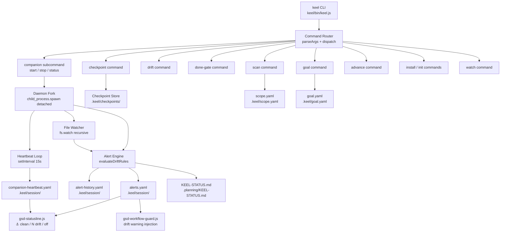
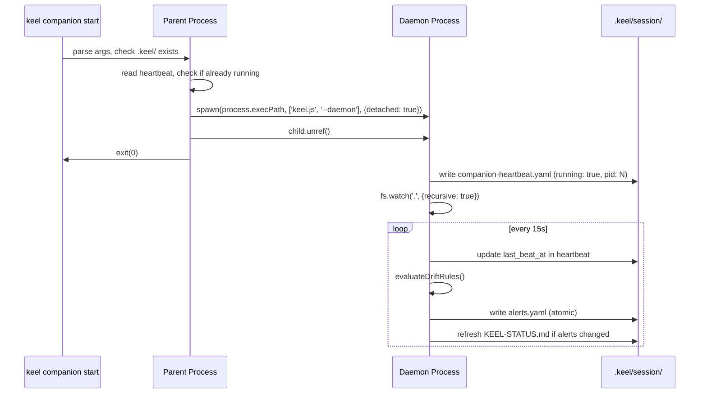

# Design Document: keel-companion

## Overview

The keel companion is a Node.js CLI binary (`keel`) that provides real-time anti-drift guardrails for GSD-managed repositories. It runs as a background daemon process watching for scope drift — files touched outside the active plan step, goal statement drift, scope expansion — and surfaces structured alerts that GSD hooks consume to display status and inject warnings into agent context.

The binary is a single entry point at `keel/bin/keel.js`, consistent with the existing Node.js toolchain (`get-shit-done/bin/gsd-tools.cjs`, `hooks/*.js`). It uses only Node.js built-ins (no npm dependencies) to keep installation friction minimal. The `keel install` command symlinks the binary onto PATH.

Key design decisions shaped by retro findings:
- Alert consolidation (cluster_id + 10s window) prevents alert storms from single pivots
- Auto-clear on condition resolution prevents stale ghost alerts (VAL-004 pattern)
- Atomic file writes (write-to-temp + rename) prevent partial reads by statusline hooks
- Graceful fallback: all GSD workflows check `command -v keel` before invoking


## Architecture




## Process Lifecycle

### Daemon Model

`keel companion start` forks a detached child process using `child_process.spawn` with `detached: true` and `stdio: 'ignore'`, then calls `child.unref()` so the parent exits immediately. The child writes its PID to the heartbeat file and enters the watch loop.



### PID File and Idempotency

The heartbeat file doubles as the PID file. Before starting, `keel companion start` reads `companion-heartbeat.yaml`, extracts `pid`, and checks if that process is alive via `process.kill(pid, 0)`. If alive, it exits 0 (idempotent). If the PID is stale (process gone), it overwrites the heartbeat and starts fresh.

### Stop Sequence

`keel companion stop` reads the PID from heartbeat, sends `SIGTERM`, waits up to 2 seconds for the process to exit, then writes `running: false` to the heartbeat. If no PID or process already gone, exits 0 silently.


## File System Contracts

### `.keel/session/companion-heartbeat.yaml`

Written atomically (temp file + `fs.renameSync`) every 15 seconds while running.

```yaml
running: true
pid: 12345
last_beat_at: "2025-01-15T10:30:00.000Z"
started_at: "2025-01-15T10:00:00.000Z"
version: "1.0.0"
```

On stop: `running: false`, `last_beat_at` preserved as final beat timestamp.

Staleness threshold: `Date.now() - new Date(last_beat_at) > 30_000ms` → companion is dead.

### `.keel/session/alerts.yaml`

Written atomically after every drift rule evaluation. Empty sequence when no alerts.

```yaml
- rule: SCOPE-001
  message: "File hooks/new-feature.js is outside active plan scope"
  severity: high
  deterministic: true
  created_at: "2025-01-15T10:31:00.000Z"
  source_file: "hooks/new-feature.js"
  cluster_id: "pivot-1736934660000"
  consolidated: false

- rule: SCOPE-001
  message: "3 related drift findings — session pivot detected"
  severity: high
  deterministic: true
  created_at: "2025-01-15T10:31:05.000Z"
  source_file: null
  cluster_id: "pivot-1736934660000"
  consolidated: true
  child_count: 3
  child_rules:
    - SCOPE-001
    - SCOPE-002
    - GOAL-001
```

Field definitions:
- `rule`: rule identifier (SCOPE-001, GOAL-001, VAL-004, STEP-001)
- `message`: human-readable description
- `severity`: `high` | `medium` | `low`
- `deterministic`: `true` if the alert is a hard blocker for `keel done`
- `created_at`: ISO 8601 UTC
- `source_file`: relative path from repo root, or `null`
- `cluster_id`: string key grouping related alerts (format: `<event>-<epoch_ms>`)
- `consolidated`: `true` for parent alerts that replace child alerts
- `child_count`: number of consolidated children (consolidated alerts only)
- `child_rules`: array of rule IDs from children (consolidated alerts only)

### `.keel/session/alert-history.yaml`

Append-only log of cleared alerts. Never truncated by the companion.

```yaml
- rule: VAL-004
  message: "Unresolved questions detected"
  cluster_id: "val-1736934000000"
  cleared_at: "2025-01-15T10:35:00.000Z"
  cleared_reason: auto
```

`cleared_reason` values: `auto` (condition resolved), `advance` (user ran `keel advance`), `checkpoint` (new checkpoint taken).

### `.keel/checkpoints/<timestamp>.yaml`

Written by `keel checkpoint`. Filename format: `YYYY-MM-DDTHH-MM-SS.yaml`.

```yaml
created_at: "2025-01-15T10:00:00.000Z"
goal: "Implement keel companion binary"
phase: "3.1"
in_scope_files:
  - "keel/bin/keel.js"
  - "keel/bin/lib/daemon.js"
  - "keel/bin/lib/alerts.js"
  - ".keel/**"
in_scope_dirs:
  - "keel/"
plan_steps:
  - id: "3.1.1"
    description: "Create entry point"
    completed: false
  - id: "3.1.2"
    description: "Implement daemon fork"
    completed: false
```

### `.keel/scope.yaml`

Written by `keel scan`. Describes the active scope manifest.

```yaml
scanned_at: "2025-01-15T10:00:00.000Z"
root: "."
in_scope:
  - pattern: "keel/**"
    reason: active_plan
  - pattern: ".keel/**"
    reason: keel_state
  - pattern: "hooks/*.js"
    reason: related_component
out_of_scope:
  - pattern: "docs/**"
  - pattern: "assets/**"
```

### `.keel/goal.yaml`

Written by `keel goal`. Single source of truth for the tracked goal.

```yaml
goal: "Implement keel companion binary with drift detection"
source: "ROADMAP.md"
phase: "3.1"
captured_at: "2025-01-15T10:00:00.000Z"
```

### `.keel/keel.yaml`

Config file written by `keel init`.

```yaml
version: "1.0.0"
initialized_at: "2025-01-15T09:00:00.000Z"
watch:
  debounce_ms: 500
  ignore_patterns:
    - ".git/**"
    - "node_modules/**"
    - ".keel/**"
alerts:
  consolidation_window_ms: 10000
  stale_heartbeat_threshold_ms: 30000
done_gate:
  require_fresh_heartbeat: true
  block_on_high_severity: true
```

### `.planning/KEEL-STATUS.md`

Written after any state-changing command. Skipped silently if `.planning/` doesn't exist.

```markdown
# KEEL Status

Last updated: 2025-01-15T10:31:00.000Z

## Goal

Implement keel companion binary with drift detection

## Phase

3.1 — keel-companion

## Next Step

3.1.2 — Implement daemon fork

## Active Alerts

- [high] SCOPE-001: File hooks/new-feature.js is outside active plan scope

## Blockers

- Resolve SCOPE-001 drift before running keel done
```

When no alerts: `## Active Alerts\n\nNo active alerts.`


## Alert Engine

### Drift Rule Definitions

| Rule ID | Trigger | Severity | Deterministic |
|---------|---------|----------|---------------|
| SCOPE-001 | File written outside `in_scope_files` + `in_scope_dirs` from active checkpoint | high | true |
| GOAL-001 | `goal.yaml` goal text differs from active checkpoint goal by >20% (Levenshtein) | high | true |
| STEP-001 | Plan step marked complete in checkpoint but corresponding file not modified | medium | false |
| VAL-004 | `unresolved-questions.yaml` exists and is non-empty | high | true |

Rules are evaluated in order: SCOPE-001 → GOAL-001 → VAL-004 → STEP-001.

### Consolidation Algorithm

```
ALGORITHM consolidateAlerts(newAlerts, existingAlerts, windowMs)
INPUT: newAlerts — alerts generated in this evaluation cycle
       existingAlerts — alerts currently in alerts.yaml
       windowMs — consolidation window (default 10000ms)
OUTPUT: finalAlerts — deduplicated, consolidated alert list

BEGIN
  now ← Date.now()
  
  // Group new alerts by cluster_id
  clusters ← GROUP newAlerts BY cluster_id
  
  FOR each (clusterId, clusterAlerts) IN clusters DO
    IF clusterAlerts.length >= 2 THEN
      // Check if all were generated within the window
      oldest ← MIN(clusterAlerts.map(a => new Date(a.created_at)))
      IF (now - oldest) <= windowMs THEN
        parent ← {
          rule: clusterAlerts[0].rule,
          message: clusterAlerts.length + " related drift findings — session pivot detected",
          severity: MAX(clusterAlerts.map(a => a.severity)),
          deterministic: ANY(clusterAlerts.map(a => a.deterministic)),
          created_at: ISO8601(now),
          source_file: null,
          cluster_id: clusterId,
          consolidated: true,
          child_count: clusterAlerts.length,
          child_rules: clusterAlerts.map(a => a.rule)
        }
        REPLACE clusterAlerts WITH [parent] IN newAlerts
      END IF
    END IF
  END FOR
  
  // Merge with existing: keep existing alerts whose conditions still hold
  // (auto-clear handled separately in evaluateDriftRules)
  RETURN newAlerts
END
```

### Auto-Clear Mechanism

On each watch cycle, the engine re-evaluates all active rules. For each alert currently in `alerts.yaml`:

1. Re-evaluate the alert's rule condition against current repo state
2. If condition is no longer true → remove from `alerts.yaml`, append to `alert-history.yaml` with `cleared_reason: auto`
3. If condition still true → keep alert (preserve original `created_at`)

This ensures VAL-004 clears within one watch cycle after `unresolved-questions.yaml` is emptied.

### Watch Cycle

```
ALGORITHM watchCycle(event, filePath)
INPUT: event — 'change' | 'rename'
       filePath — path that changed (relative to repo root)

BEGIN
  // Debounce: skip if same path changed within 500ms
  IF isDebounced(filePath) THEN RETURN END IF
  markDebounced(filePath, 500ms)
  
  // Skip keel's own state files to prevent feedback loops
  IF filePath STARTS WITH ".keel/" THEN RETURN END IF
  
  // Evaluate all drift rules
  newAlerts ← evaluateDriftRules(filePath)
  
  // Auto-clear stale alerts
  currentAlerts ← readAlertsYaml()
  clearedAlerts ← []
  FOR each alert IN currentAlerts DO
    IF NOT ruleConditionHolds(alert.rule, alert.source_file) THEN
      clearedAlerts.push(alert)
    END IF
  END FOR
  
  // Write cleared alerts to history
  FOR each alert IN clearedAlerts DO
    appendAlertHistory(alert, cleared_reason: "auto")
  END FOR
  
  // Consolidate new alerts
  activeAlerts ← currentAlerts MINUS clearedAlerts PLUS newAlerts
  finalAlerts ← consolidateAlerts(activeAlerts)
  
  // Atomic write
  writeAtomic(".keel/session/alerts.yaml", toYaml(finalAlerts))
  
  // Refresh KEEL-STATUS.md if alert state changed
  IF finalAlerts != currentAlerts THEN
    writeKeelStatus()
  END IF
END
```


## Drift Detection

### File Watcher Implementation

Uses `fs.watch(cwd, { recursive: true })` (Node.js built-in, no chokidar dependency). On platforms where recursive watch is unsupported (Linux kernel < 5.x), falls back to watching top-level directories individually.

Ignore patterns from `keel.yaml` are applied before rule evaluation:
- `.git/**`
- `node_modules/**`
- `.keel/**` (prevents feedback loops on state file writes)

### Checkpoint Diffing

`keel drift` compares current state against the most recent checkpoint:

```
ALGORITHM computeDrift(checkpoint)
INPUT: checkpoint — loaded from .keel/checkpoints/<latest>.yaml
OUTPUT: driftReport — { drifted: bool, alerts: [], blockers: [] }

BEGIN
  driftedFiles ← []
  
  // Find files modified since checkpoint was taken
  modifiedFiles ← getFilesModifiedSince(checkpoint.created_at)
  
  FOR each file IN modifiedFiles DO
    IF NOT isInScope(file, checkpoint.in_scope_files, checkpoint.in_scope_dirs) THEN
      driftedFiles.push(file)
    END IF
  END FOR
  
  // Check goal drift
  currentGoal ← readGoalYaml().goal
  goalDrifted ← levenshteinDistance(currentGoal, checkpoint.goal) / MAX(len) > 0.20
  
  // Check VAL-004
  hasUnresolvedQuestions ← fileExistsAndNonEmpty("unresolved-questions.yaml")
  
  RETURN {
    drifted: driftedFiles.length > 0 OR goalDrifted OR hasUnresolvedQuestions,
    alerts: buildAlerts(driftedFiles, goalDrifted, hasUnresolvedQuestions),
    blockers: alerts.filter(a => a.deterministic)
  }
END
```

### Scope Manifest (`keel scan`)

`keel scan` walks the repo and infers scope from:
1. Files referenced in the active checkpoint's `in_scope_files`
2. Directories containing those files
3. Files modified in the last git commit (if git is available)
4. Files matching patterns in `.planning/` state (phase task files)

Writes result to `.keel/scope.yaml`.


## Done-Gate

### Check Evaluation Order

`keel done` runs 4 checks in sequence, stopping at the first failure:

```
ALGORITHM doneGate()
OUTPUT: { passed: bool, reason: string, blockers: [] }

BEGIN
  blockers ← []
  
  // Check 1: Companion heartbeat freshness
  heartbeat ← readHeartbeatYaml()
  IF heartbeat IS NULL OR NOT heartbeat.running THEN
    blockers.push({ check: "heartbeat", message: "Companion is not running — start with: keel companion start" })
  ELSE IF (now - new Date(heartbeat.last_beat_at)) > 30000 THEN
    blockers.push({ check: "heartbeat", message: "Companion heartbeat is stale — restart with: keel companion stop && keel companion start" })
  END IF
  
  // Check 2: No high-severity deterministic alerts
  alerts ← readAlertsYaml()
  highAlerts ← alerts.filter(a => a.severity == "high" AND a.deterministic)
  IF highAlerts.length > 0 THEN
    FOR each alert IN highAlerts DO
      blockers.push({ check: "alerts", message: alert.message, rule: alert.rule })
    END FOR
  END IF
  
  // Check 3: Goal has not drifted from checkpoint
  checkpoint ← loadLatestCheckpoint()
  IF checkpoint IS NOT NULL THEN
    currentGoal ← readGoalYaml().goal
    IF levenshteinRatio(currentGoal, checkpoint.goal) > 0.20 THEN
      blockers.push({ check: "goal", message: "Goal has drifted from checkpoint — run: keel goal to re-anchor" })
    END IF
  END IF
  
  // Check 4: All plan steps completed or have recorded delta
  IF checkpoint IS NOT NULL THEN
    incompleteSteps ← checkpoint.plan_steps.filter(s => NOT s.completed AND NOT s.delta)
    IF incompleteSteps.length > 0 THEN
      blockers.push({ check: "steps", message: incompleteSteps.length + " plan steps incomplete — run: keel advance" })
    END IF
  END IF
  
  IF blockers.length == 0 THEN
    RETURN { passed: true, reason: "✓ done-gate passed", blockers: [] }
  ELSE
    RETURN { passed: false, reason: blockers[0].message, blockers: blockers }
  END IF
END
```

### Exit Codes

- `0`: all checks passed
- `1`: one or more checks failed (blockers printed to stdout)
- `2`: internal error (e.g., cannot read state files)


## Command Implementations

### Binary Entry Point

`keel/bin/keel.js` — single file, shebang `#!/usr/bin/env node`, no external dependencies.

```
keel/
  bin/
    keel.js              ← entry point + command router
    lib/
      daemon.js          ← fork/stop/status logic
      alerts.js          ← Alert Engine (evaluate, consolidate, auto-clear)
      checkpoint.js      ← checkpoint read/write/diff
      scan.js            ← scope manifest generation
      status.js          ← KEEL-STATUS.md writer
      atomic.js          ← atomic file write helper (write-temp + rename)
      yaml.js            ← minimal YAML serializer/parser (no deps)
```

### Command Table

| Command | Behavior | Exit codes |
|---------|----------|------------|
| `keel companion start` | Fork daemon if not running; idempotent if already running | 0 success, 1 no .keel/ |
| `keel companion stop` | SIGTERM daemon, update heartbeat running:false; idempotent if not running | 0 always |
| `keel companion status` | Print `running: true\|false` + `last_beat_at`; stale if >30s | 0 always |
| `keel checkpoint` | Snapshot current state to `.keel/checkpoints/<ts>.yaml`; clear cluster alerts | 0 success, 1 error |
| `keel drift` | Compare current state vs latest checkpoint; print human report | 0 clean, 1 drift found |
| `keel drift --json` | Same but output `{drifted, alerts, blockers}` JSON | 0 clean, 1 drift found |
| `keel drift --verbose` | Expand consolidated alerts to show children | 0 clean, 1 drift found |
| `keel done` | Run 4-check done-gate; print result | 0 passed, 1 blocked, 2 error |
| `keel done --json` | Same but output `{passed, reason, blockers}` JSON | 0 passed, 1 blocked |
| `keel goal` | Read goal from ROADMAP.md / .planning/ state; write goal.yaml | 0 success, 1 error |
| `keel scan` | Walk repo, infer scope, write scope.yaml | 0 success, 1 error |
| `keel advance` | Mark current step complete, write checkpoint, clear step alerts | 0 success, 1 error |
| `keel watch` | Start file watcher in foreground (non-daemon); print events to stdout | 0 on SIGINT |
| `keel install` | Create .keel/ structure, init, scan, start companion; idempotent | 0 success, 1 error |
| `keel init` | Create .keel/session/, .keel/checkpoints/, write keel.yaml | 0 success, 1 error |

### `keel install` Sequence

```
1. Check if .keel/ already exists → if yes, print advisory and exit 0
2. Create .keel/, .keel/session/, .keel/checkpoints/
3. Write .keel/keel.yaml with defaults
4. Run keel scan (infer initial scope)
5. Run keel goal (capture goal from ROADMAP.md if present)
6. Run keel checkpoint (initial anchor)
7. Run keel companion start
8. Print confirmation: "✓ keel installed — companion running\n  Next: keel drift"
```

### `keel advance` Sequence

```
1. Load latest checkpoint
2. Find first incomplete plan step
3. Mark it completed: true
4. Write updated checkpoint (new timestamp)
5. Clear all alerts with cluster_id matching that step
6. Append cleared alerts to alert-history.yaml with cleared_reason: "advance"
7. Refresh KEEL-STATUS.md
8. Print: "✓ Step <id> marked complete"
```

### PATH Installation (`keel install --link`)

Creates a symlink at `/usr/local/bin/keel` → `<repo>/keel/bin/keel.js`. Falls back to `~/bin/keel` if `/usr/local/bin` is not writable. Prints the resolved path on success.


## Components and Interfaces

### `daemon.js`

```javascript
// Start the companion daemon. Returns immediately after fork.
// Throws if .keel/ does not exist.
function startDaemon(cwd)

// Stop the companion daemon via SIGTERM.
// Resolves when process exits or was already stopped.
async function stopDaemon(cwd)

// Read heartbeat and return status object.
// Returns { running: false } if heartbeat file absent.
function getStatus(cwd)
// → { running: bool, pid: number|null, last_beat_at: string|null, stale: bool }

// Internal: daemon entry point (called when process.argv includes '--daemon')
function runDaemonLoop(cwd)
```

### `alerts.js`

```javascript
// Evaluate all drift rules against current repo state.
// Returns array of new alert objects (not yet written to disk).
function evaluateDriftRules(cwd, changedFile)
// → Alert[]

// Consolidate alerts within the time window.
// Mutates nothing; returns new array.
function consolidateAlerts(alerts, windowMs)
// → Alert[]

// Determine if a rule's source condition currently holds.
function ruleConditionHolds(rule, sourceFile, cwd)
// → boolean

// Read alerts.yaml; returns [] if file absent or empty.
function readAlerts(cwd)
// → Alert[]

// Write alerts atomically.
function writeAlerts(cwd, alerts)

// Append entries to alert-history.yaml.
function appendAlertHistory(cwd, clearedAlerts, clearedReason)
```

### `checkpoint.js`

```javascript
// Write a new checkpoint snapshot.
function writeCheckpoint(cwd, data)
// data: { goal, phase, in_scope_files, in_scope_dirs, plan_steps }

// Load the most recent checkpoint. Returns null if none exist.
function loadLatestCheckpoint(cwd)
// → Checkpoint | null

// Compute drift between current state and a checkpoint.
function computeDrift(cwd, checkpoint)
// → { drifted: bool, alerts: Alert[], blockers: Alert[] }
```

### `atomic.js`

```javascript
// Write content to path atomically via temp file + rename.
// Prevents partial reads by concurrent hook processes.
function writeAtomic(filePath, content)
```

### `yaml.js`

Minimal YAML serializer/parser covering only the subset used by keel state files (strings, numbers, booleans, arrays of objects, nested objects). No external dependency. Follows the same pattern as the rest of the codebase which avoids npm deps in hook scripts.

```javascript
function parseYaml(text)   // → JS value
function stringifyYaml(value)  // → string
```


## Error Handling

### Scenario: `.keel/` does not exist

**Condition**: Any command invoked before `keel install`
**Response**: Print `keel not initialized — run: keel install` to stderr, exit 1
**Recovery**: User runs `keel install`

### Scenario: Companion crashes mid-session

**Condition**: Daemon process dies; heartbeat becomes stale (>30s)
**Response**: `gsd-statusline.js` displays `⚓ stale` in dim; no automatic restart
**Recovery**: User runs `keel companion stop && keel companion start`

### Scenario: Heartbeat file partially written

**Condition**: Race between daemon write and hook read
**Response**: Atomic write (temp + rename) prevents partial reads; hook reads complete file or previous version
**Recovery**: Automatic — next heartbeat write succeeds

### Scenario: `keel` binary not on PATH

**Condition**: Binary absent or removed after install
**Response**: `init.cjs` `detectKeel()` returns `{ keel_installed: false }`; all GSD workflows skip keel blocks; `gsd-statusline.js` continues displaying last known heartbeat state without invoking binary
**Recovery**: User re-runs `keel install --link`

### Scenario: Permission error creating `.keel/`

**Condition**: `keel install` in read-only directory
**Response**: Print descriptive error to stderr with the failing path, exit 1
**Recovery**: User fixes permissions or runs from correct directory

### Scenario: `fs.watch` not supported recursively

**Condition**: Linux kernel without inotify recursive support
**Response**: Fall back to watching each top-level directory individually; log warning to stderr
**Recovery**: Automatic fallback; slightly higher overhead


## Correctness Properties

These properties are suitable for property-based testing (PBT) using fast-check.

### P1: Alert Consolidation Invariant

For any set of alerts generated by a single root cause event (same `cluster_id`), the number of entries written to `alerts.yaml` must be ≤ the number of distinct root causes.

```
∀ alerts ∈ alerts.yaml,
  ∀ clusterId ∈ distinct(alerts.map(a => a.cluster_id)):
    count(alerts where cluster_id == clusterId AND NOT consolidated) == 0
    OR count(alerts where cluster_id == clusterId) == 1
```

**PBT approach**: Generate N alerts with the same `cluster_id` within a 10s window. After consolidation, assert `result.length == 1` and `result[0].consolidated == true` and `result[0].child_count == N`.

### P2: Staleness Invariant

No alert in `alerts.yaml` shall persist after its source condition resolves.

```
∀ alert ∈ alerts.yaml:
  ruleConditionHolds(alert.rule, alert.source_file, cwd) == true
```

**PBT approach**: Generate arbitrary alert sets, then for each alert randomly toggle its source condition to false. After one watch cycle, assert no alert with a false condition remains in `alerts.yaml`.

### P3: Atomic Write Integrity

The heartbeat file and alerts file are never in a partially-written state observable by concurrent readers.

```
∀ read(heartbeat.yaml): parse(content) succeeds OR content == previous_valid_content
∀ read(alerts.yaml): parse(content) succeeds OR content == previous_valid_content
```

**PBT approach**: Simulate concurrent reads during writes using `fs.readFileSync` in a tight loop while `writeAtomic` is executing. Assert every read either parses successfully or returns the previous valid content.

### P4: Idempotent Start

Running `keel companion start` N times results in exactly one running daemon process.

```
∀ n ≥ 1: after n calls to startDaemon(cwd),
  count(processes matching daemon signature) == 1
```

**PBT approach**: Call `startDaemon` 1–5 times in sequence. Assert exactly one process with the keel daemon signature is running after all calls.

### P5: Done-Gate Soundness

`keel done` exits 0 if and only if all 4 checks pass simultaneously.

```
doneGate().passed == true
  ↔ heartbeatFresh() ∧ noHighAlerts() ∧ goalNotDrifted() ∧ allStepsComplete()
```

**PBT approach**: Generate arbitrary combinations of the 4 check states (fresh/stale, alerts/no-alerts, drifted/clean, complete/incomplete). Assert `passed` matches the conjunction of all 4 conditions.

### P6: Alert History Completeness

Every alert that is removed from `alerts.yaml` must appear in `alert-history.yaml` with a `cleared_at` timestamp and a valid `cleared_reason`.

```
∀ alert removed from alerts.yaml:
  ∃ entry ∈ alert-history.yaml where
    entry.rule == alert.rule AND
    entry.cluster_id == alert.cluster_id AND
    entry.cleared_at IS valid ISO 8601 AND
    entry.cleared_reason ∈ { "auto", "advance", "checkpoint" }
```

**PBT approach**: Generate arbitrary alert sets, trigger clearing via auto/advance/checkpoint paths, assert every removed alert has a corresponding history entry.

### P7: Heartbeat Monotonicity

`last_beat_at` in the heartbeat file must be non-decreasing across successive writes.

```
∀ consecutive heartbeat writes t1, t2:
  new Date(t2.last_beat_at) >= new Date(t1.last_beat_at)
```

**PBT approach**: Run the heartbeat loop for N iterations with arbitrary clock values. Assert each successive `last_beat_at` is ≥ the previous.


## Testing Strategy

### Unit Testing

**Framework**: Node.js built-in `node:test` + `assert` (no external test runner, consistent with the zero-dependency philosophy).

**Key unit test areas**:

- `yaml.js`: round-trip parse/stringify for all YAML shapes used in state files
- `atomic.js`: verify temp file is cleaned up on success and failure
- `alerts.js` `consolidateAlerts()`: all consolidation edge cases (1 alert, 2 alerts same cluster, 2 alerts different clusters, window boundary)
- `alerts.js` `ruleConditionHolds()`: each rule with true/false conditions
- `checkpoint.js` `computeDrift()`: clean state, single drifted file, goal drift, VAL-004
- `daemon.js` `getStatus()`: absent file, running=true fresh, running=true stale, running=false

### Property-Based Testing

**Library**: `fast-check` (add as dev dependency only).

Implement the 7 correctness properties defined above as fast-check property tests:

```javascript
// P1: Consolidation invariant
fc.assert(fc.property(
  fc.array(alertArbitrary(), { minLength: 2, maxLength: 10 }),
  (alerts) => {
    const sameCluster = alerts.map(a => ({ ...a, cluster_id: 'test-cluster' }))
    const result = consolidateAlerts(sameCluster, 10_000)
    return result.length === 1 && result[0].consolidated === true
  }
))
```

### Integration Testing

**Approach**: Spin up a real daemon against a temp directory, make file changes, assert alerts appear within 5 seconds.

**Key integration scenarios**:
1. Full lifecycle: install → start → write out-of-scope file → assert SCOPE-001 alert → delete file → assert alert cleared
2. Alert storm: write 3 out-of-scope files within 10s → assert single consolidated alert
3. Done-gate: start companion → take checkpoint → write in-scope files → run `keel done` → assert exit 0
4. Stale heartbeat: kill daemon process directly → wait 31s → assert `keel companion status` shows stale

### Manual Smoke Tests

Run against a real GSD repo:
```bash
keel install
keel companion status   # → running: true
keel drift              # → clean
# touch a file outside scope
keel drift              # → 1 drift finding
keel done               # → exit 1, blocker listed
keel advance            # → step marked complete
keel done               # → exit 0
```

## Performance Considerations

- Heartbeat write: 15s interval, ~200 bytes per write — negligible I/O
- Watch cycle debounce: 500ms prevents thrashing on rapid saves
- Alert evaluation: O(N) where N = number of in-scope files in checkpoint; expected N < 500 for typical GSD repos
- `keel drift` cold start: reads 1 checkpoint file + current file mtimes; target < 200ms
- `keel done` cold start: reads heartbeat + alerts + checkpoint; target < 100ms

## GSD Phase Lifecycle Integration

### Overview

GSD fully orchestrates the keel companion lifecycle. The companion starts automatically when GSD phases begin and stops when they end. Users never invoke keel directly during normal GSD operation.

### Phase Start Sequence

When a GSD phase begins (via `execute-phase` or equivalent):

```
1. GSD_Init returns JSON context including keel_installed: bool
2. IF keel_installed == true:
   a. Invoke: keel companion start  (fire-and-forget, stdout+stderr → /dev/null)
   b. Invoke: keel checkpoint        (anchor phase start state)
3. Continue with phase work
```

`keel companion start` is idempotent — if the companion is already running, it exits 0 without disruption. GSD workflows never check `keel companion status` before calling start; the idempotency guarantee makes the status check unnecessary and avoids latency.

### Phase End Sequence

When a GSD phase ends (via `verify-work` or equivalent):

```
1. IF keel_installed == true:
   a. Invoke: keel done              (done-gate check)
   b. IF keel done exits non-zero:
      - Surface blocker message to agent
      - Halt phase completion
      - Print resolution command (keel advance or keel checkpoint)
   c. IF keel done exits 0:
      - Invoke: keel companion stop  (fire-and-forget, stdout+stderr → /dev/null)
2. Continue with phase completion
```

### Silent Invocation Contract

All GSD workflow keel invocations redirect stdout and stderr to `/dev/null` unless the output is explicitly consumed (e.g., `keel done` blocker messages, `keel drift --json` output). This ensures keel never produces visible noise during normal GSD operation.

```bash
# Pattern for fire-and-forget keel calls in GSD workflows
keel companion start 2>/dev/null
keel checkpoint 2>/dev/null

# Pattern for consumed output
DRIFT_JSON=$(keel drift --json 2>/dev/null)
```

### Milestone Completion Blocking

When `complete-milestone` is invoked:

```
1. IF keel_installed == true AND .keel/session/alerts.yaml exists:
   a. Read alerts.yaml
   b. IF any alert has severity: high AND deterministic: true:
      - Invoke: keel done
      - IF keel done exits non-zero: block milestone completion, surface blockers
2. Continue with milestone completion
```

If `.keel/session/alerts.yaml` does not exist or is empty, the drift gate is treated as passed.

### Fallback When Binary Is Absent

If `command -v keel` fails at any GSD phase hook invocation point, the entire keel block is skipped silently. The `keel_installed` field from `GSD_Init` is the single gate — GSD workflows check this field once rather than re-running `command -v keel` inline.


## Drift Data Feedback into GSD Context

### KEEL-STATUS.md Refresh Contract

The companion refreshes `.planning/KEEL-STATUS.md` whenever alert state changes during a watch cycle. This keeps the file current for GSD agents reading `.planning/` context.

Refresh triggers:
- Any new alert written to `alerts.yaml`
- Any alert cleared from `alerts.yaml`
- `keel companion start` (initial write, before first watch cycle)
- Any state-changing keel command (`keel checkpoint`, `keel advance`, `keel goal`, `keel scan`)

The file is skipped silently if `.planning/` does not exist.

### High-Severity Warning Section

When KEEL-STATUS.md is written and one or more `severity: high` alerts are active, the file includes a `## ⚠ Drift Warning` section:

```markdown
## ⚠ Drift Warning

The following blockers must be resolved before phase completion:

- SCOPE-001: File hooks/new-feature.js is outside active plan scope
  Resolution: run `keel advance` to acknowledge or revert the file

- VAL-004: Unresolved questions detected
  Resolution: resolve questions in unresolved-questions.yaml
```

### Drift Report JSON Persistence

`keel drift --json` writes its output to two destinations simultaneously:
1. stdout (for direct consumption by calling scripts)
2. `.keel/session/drift-report.json` (for GSD hooks to read without re-invoking keel)

This allows GSD hooks to read the last drift report without spawning a subprocess.

### GSD_Init Context Enrichment

When `GSD_Init` is called with `keel_installed: true`, the response includes:

```json
{
  "keel_installed": true,
  "keel_status": {
    "running": true,
    "pid": 12345,
    "last_beat_at": "2025-01-15T10:30:00.000Z",
    "stale": false
  }
}
```

`keel_status` is `null` if the heartbeat file is absent. This gives GSD workflows heartbeat state without a separate file read.

### Context Freshness Gate

GSD workflows include KEEL-STATUS.md in agent context only when:
- The file exists at `.planning/KEEL-STATUS.md`
- The `Last updated` timestamp is within 60 seconds of the current time

If the file is absent or stale, the workflow proceeds without KEEL context and surfaces no error to the agent.


## Git Event Integration

### Git Hook Installation

`keel install` installs two git hooks into `.git/hooks/`:

**`.git/hooks/post-checkout`**:
```bash
#!/bin/sh
# keel git integration — post-checkout
keel git-event branch-switch "$1" "$2" "$3" 2>/dev/null || true
```

**`.git/hooks/post-commit`**:
```bash
#!/bin/sh
# keel git integration — post-commit
keel git-event commit 2>/dev/null || true
```

Both hooks exit 0 unconditionally (via `|| true`) so a keel failure never blocks git operations. If `.git/` does not exist, `keel install` skips hook installation silently.

### Branch Switch Handling

When a `post-checkout` event fires (branch switch, not file checkout):

```
ALGORITHM handleBranchSwitch(prevHead, newHead, isBranchSwitch)
BEGIN
  IF NOT isBranchSwitch THEN RETURN END IF  // file checkout, not branch switch

  newBranch ← getCurrentBranch()
  activePhase ← loadLatestCheckpoint().phase  // e.g., "3.1"

  IF newBranch CONTAINS activePhase THEN
    // Branch matches active phase — clean context switch
    clearAlertsWithRule("GIT-001")
    writeCheckpoint(cwd, { ...currentState, branch: newBranch })
    writeKeelStatus(cwd)
  ELSE
    // Branch does not match — potential context mismatch
    writeAlert({
      rule: "GIT-001",
      message: "Branch switched to '" + newBranch + "' — verify this matches active phase " + activePhase,
      severity: "medium",
      deterministic: false,
      cluster_id: "git-" + Date.now()
    })
    writeKeelStatus(cwd)
  END IF
END
```

### Commit Auto-Checkpoint

When a `post-commit` event fires and the companion is running:

```
ALGORITHM handleCommit()
BEGIN
  IF NOT companionIsRunning() THEN RETURN END IF
  writeCheckpoint(cwd, { ...currentState, git_commit: getHeadCommitHash() })
  writeKeelStatus(cwd)
END
```

This anchors the committed state as the new drift baseline, preventing false positives for files that were intentionally committed.

### Git Rule Definition

| Rule ID | Trigger | Severity | Deterministic |
|---------|---------|----------|---------------|
| GIT-001 | Branch switch to a branch not matching the active GSD phase identifier | medium | false |

GIT-001 is non-deterministic (does not block `keel done`) because branch switches may be intentional workflow steps.

### Drift Report Branch Context

`keel drift` always includes branch context in its output:

```
Branch at checkpoint: feature/phase-3.1-keel-companion
Current branch:       feature/phase-3.1-keel-companion
Branch status:        ✓ matches checkpoint
```

When branches differ:
```
Branch at checkpoint: feature/phase-3.1-keel-companion
Current branch:       main
Branch status:        ⚠ context mismatch — run keel checkpoint to re-anchor
```

The `keel drift --json` output includes:
```json
{
  "drifted": true,
  "alerts": [...],
  "blockers": [...],
  "branch": {
    "at_checkpoint": "feature/phase-3.1-keel-companion",
    "current": "main",
    "mismatch": true
  }
}
```


## Claude Code CLI Compatibility

### Daemon Fork Requirements

The daemon fork uses `child_process.spawn` with specific options to ensure compatibility with Claude Code's execution environment:

```javascript
const child = spawn(process.execPath, [keelBinPath, '--daemon'], {
  detached: true,
  stdio: 'ignore',   // do not inherit Claude Code's stdio handles
  cwd: cwd,
  env: process.env
})
child.unref()        // parent exits immediately; daemon runs independently
```

This ensures:
- The daemon does not inherit Claude Code's stdio file descriptors
- The daemon survives the parent process (Claude Code agent) exiting
- The daemon continues running if Claude Code is interrupted or killed

### PATH Resolution for Claude Code

`keel install --link` creates a symlink at `/usr/local/bin/keel` (fallback: `~/bin/keel`) and prints the resolved path:

```
✓ keel linked: /usr/local/bin/keel → /path/to/repo/keel/bin/keel.js
  Add to PATH if not already present: export PATH="/usr/local/bin:$PATH"
```

This allows Claude Code workflows to resolve `keel` via PATH without project-relative path assumptions.

### Statusline Hook Compatibility

`gsd-statusline.js` reads `.keel/session/companion-heartbeat.yaml` directly from disk rather than invoking `keel companion status`. This avoids PATH resolution failures in the hook's execution context within Claude Code terminals.

```javascript
// Correct: direct file read (no subprocess)
const heartbeat = readHeartbeatFile(cwd)

// Incorrect: subprocess invocation (PATH may not resolve in hook context)
// const result = execSync('keel companion status')
```

### GSD_Init Binary Detection

`init.cjs` detects keel via `which keel` (binary presence), not `.keel/` directory presence:

```javascript
function detectKeel(cwd) {
  try {
    execSync('which keel', { stdio: 'ignore' })
    return { keel_installed: true }
  } catch {
    return { keel_installed: false }
  }
}
```

`keel_installed: false` is returned when the binary is absent regardless of `.keel/` directory state. This is accurate in all Claude Code working directory contexts.

### Fire-and-Forget Invocation Pattern

GSD workflows running in Claude Code invoke keel as fire-and-forget bash commands, not blocking subprocesses:

```bash
# Fire-and-forget: exit code is the only signal consumed
keel companion start 2>/dev/null
echo $?  # 0 = success, non-zero = failure
```

The workflow never waits for confirmation output from keel — exit code 0 is the complete success signal.


## Security Considerations

- The daemon runs as the same user who invoked `keel companion start` — no privilege escalation
- State files in `.keel/session/` should be added to `.gitignore` (written by `keel init`)
- `keel.yaml` config does not accept shell commands or eval-able content — all values are data
- The YAML parser (`yaml.js`) does not execute arbitrary code; it handles only the known schema shapes
- Git hook scripts installed by `keel install` contain only static keel invocations — no user-controlled content is interpolated into hook scripts

## Dependencies

**Runtime**: None. Node.js built-ins only (`fs`, `path`, `child_process`, `os`, `crypto`).

**Dev/test**: `fast-check` for property-based tests.

**Node.js version**: ≥ 18.0.0 (required for `fs.watch` recursive option on macOS/Windows and `node:test` built-in).

Consistent with the existing codebase: `gsd-tools.cjs`, `hooks/*.js`, `bin/install.js` all use zero runtime npm dependencies.
